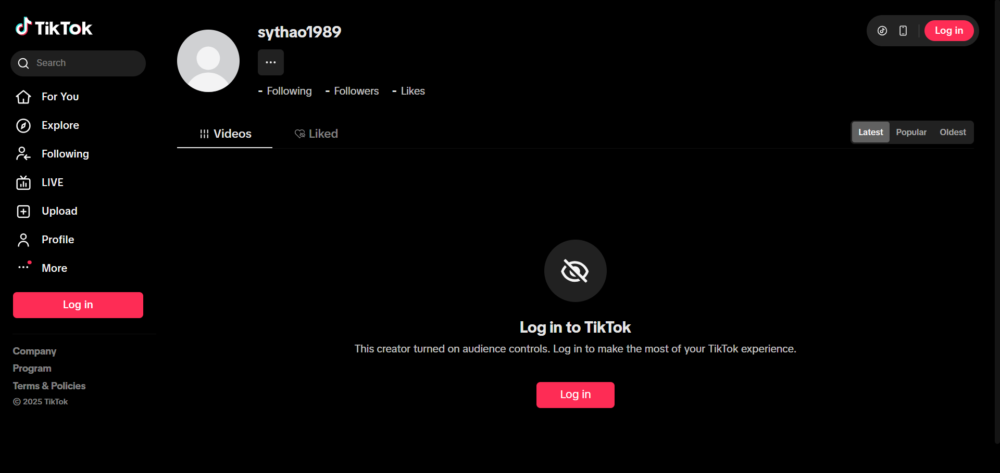

# Tiktok Bulk Downloader Desktop App

## Project Setup

### Set up environment variables (optional)

```
> [!NOTE]
> Because some accounts may require login to view their videos, you will need to provide your account's cookie (sid_tt is sufficient) for it to function properly. The image below is an example of an account requiring login to view their videos.
```



- Create an `.env` file at the root of the project and fill the value, example:
  ```plaintext
  RENDERER_VITE_TIKTOK_COOKIE="sid_tt=e4203...."
  ```

### Install

```bash
$ npm install
```

### Development

```bash
$ npm run dev
```

### Build

```bash
# For windows
$ npm run build:win

# For macOS
$ npm run build:mac

# For Linux
$ npm run build:linux
```
